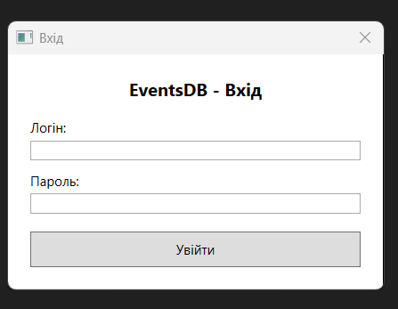
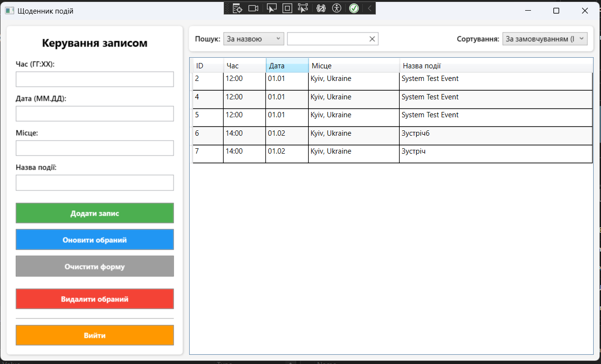

# EventsDB — Щоденник подій

Десктопний застосунок для ведення журналу подій із системою авторизації та розмежуванням прав доступу. Розроблений у рамках курсової роботи з об'єктно-орієнтованого програмування на C#.

---

## Технології

- **Мова:** C# (.NET 10)
- **UI фреймворк:** WPF (Windows Presentation Foundation)
- **База даних:** SQLite через `Microsoft.Data.Sqlite`
- **Хешування паролів:** SHA-256
- **Патерни:** Repository, Service Layer, Layered Architecture

---

## Функціонал

### Авторизація
- Вхід за логіном і паролем
- Паролі зберігаються у вигляді SHA-256 хешу
- Автоматичне створення адміністратора при першому запуску (`admin` / `admin123`)
- Сесія користувача через `SessionService`

### Ролі
| Роль | Перегляд | Додавання | Редагування | Видалення |
|------|----------|-----------|-------------|-----------|
| Admin | ✅ | ✅ | ✅ | ✅ |
| Viewer | ✅ | ❌ | ❌ | ❌ |

### Робота з подіями
- Додавання, редагування, видалення записів
- Поля: час (ГГ:ХХ), дата (ММ.ДД), місце, назва події
- Валідація формату часу та дати через регулярні вирази

### Пошук і сортування
- Пошук за назвою, часом, місцем, датою
- Сортування за ID, часом, місцем, назвою, датою (зростання / спадання)

---

## Структура проекту
EventsDB/
├── Data/
│   └── DatabaseContext.cs      # З'єднання з БД, SQL-запити
├── Helpers/
│   └── Validator.cs            # Валідація формату часу і дати
├── Models/
│   ├── Record.cs               # Модель події
│   └── User.cs                 # Модель користувача
├── Repositories/
│   └── EventRepository.cs      # Патерн Repository для подій
├── Services/
│   ├── AuthService.cs          # Логін, реєстрація, хешування
│   └── SessionService.cs       # Поточна сесія користувача
├── App.xaml / App.xaml.cs      # Точка входу, ініціалізація
├── LoginWindow.xaml/.cs        # Вікно авторизації
└── MainWindow.xaml/.cs         # Головне вікно застосунку

---

## Як запустити

### Вимоги
- Windows 10/11
- [.NET 10 SDK](https://dotnet.microsoft.com/download)

### Запуск
```bash
git clone https://github.com/YOUR_USERNAME/EventsDB.git
cd EventsDB
dotnet run
```

При першому запуску автоматично створюється база даних `events.db` і адміністратор:
- **Логін:** `admin`
- **Пароль:** `admin123`

---

## Скріншоти

### Вікно авторизації



### Головне вікно


---

## Автор

**Яворський Максим**  
Група: ПД-25
Дисципліна: Об'єктно-орієнтоване програмування С#
Рік: 2026
